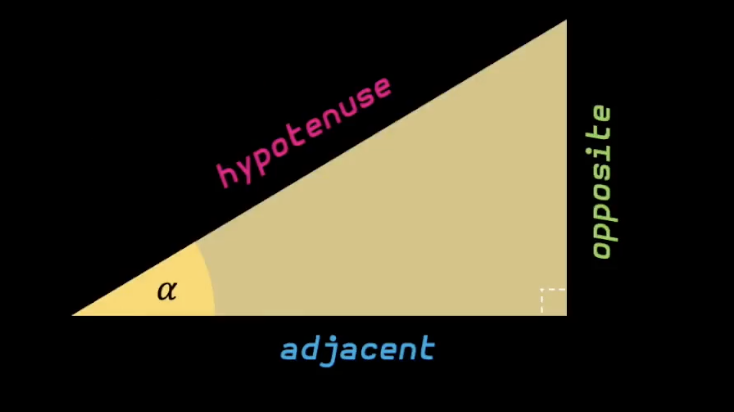

# Trigonometry review

## A Review of degrees and Radians

### Radian

> $180˚ = 3.14_{rad} = 1π$

> $a_{rad} = a_{deg} * \frac{π}{180}$

> $a_{deg} = a_{rad} * \frac{180}{π}$

- Dimension of the projection plane: 320 x 200
- Distance between rays: $\frac{60˚}{320}$

## A Review of Sine Cosine and Tangent

> $sin(a) = \frac{opposite}{hypotenuse}$

> $cos(a) = \frac{adjacent}{hypotenuse}$ 

> $tan(a) = \frac{opposite}{adjacent}$

- Given two points $A(x,y)$ and $B(x',y')$. The distance between two point can be
calculate by formula $distance=\sqrt{(y'-y)^2 + (x'-x)^2}$.
